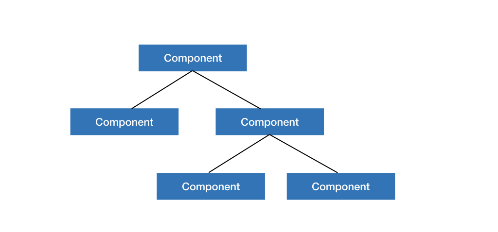

# Getting Started

Visualizations in Oviz are made up of **components**.
Each visualization has _one root component_, and each component can have its _child components_.
Therefore, a _component tree_ is formed by nesting the components.



Oviz has a **templating language**.
Rather than writing lines of code to build the structure of the component tree, you mainly _describe_ it through a template like this:

```bvt
Component {
    Component {
        // ...
    }
    Component { }
}
```

Oviz renders visualizations to SVG or Canvas. Typically SVG is the best choice, but if you have too many components to render, such as more than 100,000 points in a scatter chart, you may consider using Canvas for better performance.

!> Note that rendering to Canvas is currently at an experimental stage.

## Usage

You can import Oviz directly from the `Oviz` package.

```js
import Oviz from "oviz";
```

All you need to do is calling `Oviz.visualize` when the page is ready.
Usually, calling it in the listener of `DOMContentLoaded` event of `document` is OK, but sometimes the correct size of the target element can only be determined when the `load` event of `window` is fired.

```js
function init() {
    Oviz.visualize({
        el: "#canvas",
        template,
    });
}

window.addEventListener("load", init);
```

`el` is the target DOM element. It can be either a CSS selector string or an HTML element.
For example, `#canvas` selects the element with id equals to "canvas".
Oviz _clears_ all content inside this element, and then puts an `svg` or `canvas` element inside it depending on the renderer type.

You have two choices to define the size, renderer type (SVG or Canvas), and the content of the visualization: having a global template or using a root component.

#### Having a global template

For simple visualizations, you may want to describe the whole diagram using inside a single template. In this case, you only need to provide the template as a _string_ for the `template` option of `Oviz.visualize`.

Since you are describing the whole diagram using the template, you should also declare the size and renderer type in it by wrapping the root component in an `svg` or `canvas` block:

```bvt
svg {
    width = auto
    height = 400
    Component {
        // ...
    }
}
```

`width` and `height` define the size of the visualization. They can be numbers or `auto`.
`auto` is a special value which equals to the container size. By default `width` and `height` are all `auto`.

Remember that since the visualization only has one root element, there should be only one component block declared inside the `svg` or `canvas` block.

#### Having a root component

For complicated visualizations, you may need to write _custom components_, and use a custom component as the root component.
We will cover how to write custom components later.
In this case, you need to specify the renderer type through the `renderer` option, and optionally its size through the `width` or `height` option.

```js
Oviz.visualize({
    el: "#canvas",
    root: new MyComponent(),
    renderer: "svg",
    height: 400,
});
```

## VSCode Plugin

A VSCode plugin is provided to enable the syntax highlighting for templates.
[Download it here](https://gitlab.deepomics.org/lhc/bvt-vscode/tags).

Install the vsix file through the plugin menu - Install from VSIX.

There are two ways to enable syntax highlighting in JavaScript/TypeScript.

When using the `this.t` tag or the `Oviz.c()` function (we will cover them later), the string is treated as a template automatically.

```js
const t = this.t`
Component {
    // ...
}
`;
```

```js
Oviz.c(`
Component {
    // ...
}
`);
```

For normal JavaScript/TypeScript strings, add `//bvt` at the beginning of them:

```js
const t = `//bvt
Component {
    // ...
}
`;
```
