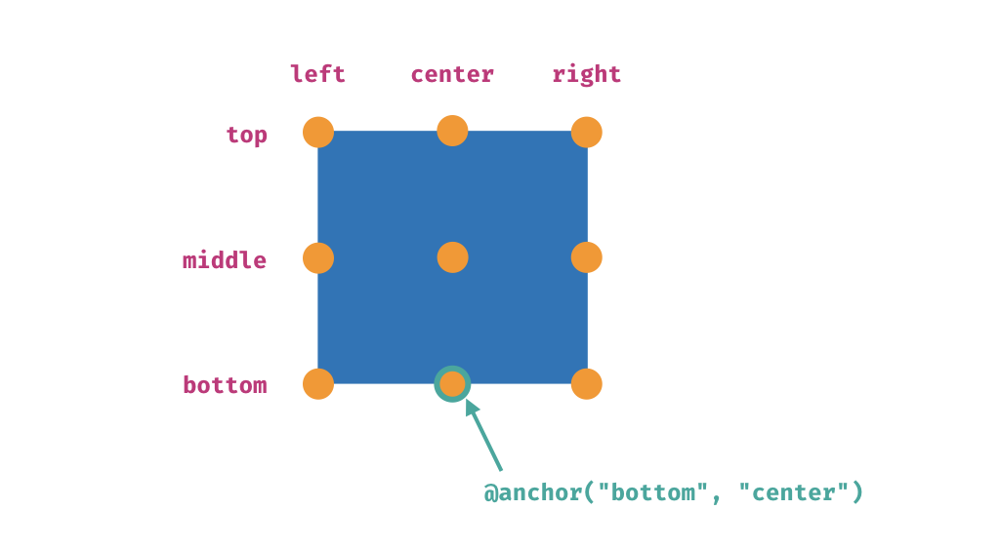
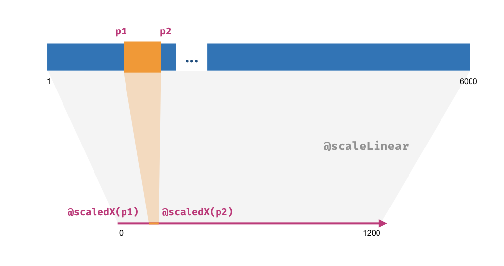

# Layout

The framework features an auto-layout system.

A component (including any custom component) **defines its own coordinate system**.
That said, each child component translates starting from the origin point of its parent component.

<div class="demo" data-height="220">
Component {
    x = 50; y =50;
    width = 500; height = 500
    Rect {
        width = 100%; height = 100%
        fill = "rgba(0,0,0,.1)"; stroke = "#abc"
    }
    Rect {
        x = 20; y = 20
        width = 40; height = 60
    }
}
</div>

It's also possible to define a local **scale system** or a **polar coordinate system**, which will be introduced later in this page.

## Anchors

While we can define the position of any element by its `x` and `y`, the point that the position (origin point) should be aligned to, or the **anchor**, can also be customized.
Anchors are especially useful in cases such as you need to draw a marker at the end of a line, and therefore the marker's center should be aligned to the line end.

There are 3 possible horizontal positions (`left`, `center`, `right`) and 3 vertical ones (`top`, `middle`, `left`), so there are 9 possible anchor positions in total for a component.
The default anchor for all components is `(top, left)`.

You use a helper `@anchor` to denote an anchor.
It accepts two arguments, one for the vertical position and the other for horizontal position, and the order doesn't matter. You should specify the names directly as strings.



The following example shows how the anchor affects a component's position.
The blue dot indicates the original position (defined by `x` and `y`) of the `Rect`.

<div class="demo" data-height="220">
Component {
    Rect {
        anchor = @anchor("left", "top")
        x = 100; y = 100
        width = 40; height = 40
        fill = "rgba(255,255,0,.4)"
    }
    Rect {
        anchor = @anchor("middle", "center")
        x = 100; y = 100
        width = 40; height = 40
        fill = "rgba(255,0,0,.2)"
    }
    Rect {
        anchor = @anchor("right", "bottom")
        x = 100; y = 100
        width = 40; height = 40
        fill = "rgba(0,0,255,.2)"
    }
    Circle {
        anchor = @anchor("middle", "center")
        x = 100; y = 100;
        fill = "blue"; r = 2
    }
}
</div>

## Relative Sizes and Positions

We know that components have their widths and heights. The children of a component can thus have **relative sizes and positions** based on their parent.

We denote such a relative value (called **geometry value** in Oviz) as a combination of a _percentage_ and a _fixed offset_, and we can express it in the form of `a%±b`.
Geometry values can be used for geometry props, such as `x`, `y`, `width`, `height`, and `r` for `Circle`. Just write something like `80%` and the component will recognize it.

The offset is optional, for example, `100%`, `80%`, `100%-10`, `50%+5` are all valid geometry expressions.

?> Plain numbers can also be considered as geometry values that only have offsets.

Now we can draw a `Rect` that stretches over the container but has a 10px _margin_ around.

<div class="demo" data-height="220">
Component {
    width = 200; height = 200
    Rect {
        width = 100%; height = 100%
        fill = "#abc"
    }
    Rect {
        x = 10; y = 10
        width = 100%-20; height = 100%-20
        fill = "#2870eb"
    }
}
</div>

?> By default, a `Component` has `width = 100%` and `height = 0`.

### Dynamic geometry values

Other than literals, you can also supply the value for geometry props using the `@geo(percantage, offset)` helper.
For example, `@geo(100, -5)` is equivalent to `100%-5`, and therefore you can use _dynamic_ values for geometry props, such as `@geo(width, x * 2)`.

<div class="demo" data-height="220">
Component {
    @let widths = [25, 50, 75, 100]
    @for (width, i) in widths {
        Rect {
            y = i * 30
            width = @geo(width, 0)
            height = 25
            fill = "#fb5"
        }
    }
}
</div>

## Scales

`Component` can also set up a local scale system by specifying two _scale props_, namely `xScale` and `yScale`.

The scale system is especially useful when we need to map some raw data to the actual size of the graph.
For example, we need to render a gene of 8000bp length, but we usually have a browser window of no more than 1200px.
That said, we need to map the domain [1, 8000] to a range of [0, 1200].
A _scale_ is used to do the mapping, and you can attach it directly to a container component, then all children inside the container will have their positions and sizes scaled.
Currently, we use d3-scale as the underlying implementation, so it's helpful to know more about the scale types provided by it.

Values for `xScale` and `yScale` should be scale helpers. All those helpers start with `@scale`, such as `@scaleLinear`. `@scaleLinear` accepts four optional arguments:

```bvt
@scaleLinear(domain, domain, range, range)
```

Supplying 2 arguments to the helper, such as `@scaleLinear(0, 1000)`, is the most common usage.
It sets the domain to [0, 1000], and the range will automatically be [0, _size_], where _size_ is the component's width for `xScale` and the height for `yScale`.

Supplying 4 arguments to the helper sets both the domain and range explicitly.
Supplying no argument to the helper, such as `@scaleLinear()`, makes it return the identical scale with domain and range both being [0, width].



Scaling is not applied automatically. You must use the corresponding helpers `@scaledX` and `@scaledY` together.

<div class="demo" data-height="250">
Component {
    @let data = [
        [150, 490], [420, 830], [800, 260], [600, 80]
    ]
    xScale = @scaleLinear(0, 1000)
    yScale = @scaleLinear(0, 1000)
    @for (item, index) in data {
        Circle.centered {
            key = index
            x = @scaledX(item[0])
            y = @scaledY(item[1])
            r = 4
            fill = "red"
        }
    }
}
</div>

You can find a list of supported scale helpers in the reference.

Scale systems can be inherited. Unless the child components define their new scale systems, in which case the parent's scale system is
overwritten, the parent's scale system remains available for **all nested child components**.

Some components, such as `Axis`, require to be put in a scale system:

<div class="demo" data-height="250">
Component {
    @let data = [150, 420, 600, 800]
    Component {
        x = 20; y = 20
        width = 100%-40; height = 40
        xScale = @scaleLinear(0, 1000)
        @for (item, index) in data {
            Circle.centered {
                key = index
                x = @scaledX(item)
                y = 8
                r = 4
                fill = "red"
            }
        }
        Axis("top");
    }
}
</div>

## Polar Coordinate System

A `Component` can also have a different type of coordinate system. The prop `coord` can be either `"cartesian"` or `"polar"`; `"cartesian"` is the default.
Once `"polar"` is specified, all containing components' positions (`x` and `y`) are treated as coordinates inside a polar coordinate system.

In a polar coordinate system, `x` becomes **the angle (theta)** and `y` becomes the **radius**.
By default, the theta value is **in degree (°)**, but if you found that radian is more convenient in your case, supply `coordUseRad = true`.

The origin of the polar coordinate system is the **center point** (i.e. (50%, 50%)) of this component.

<div class="demo" data-height="200">
Component {
    coord = "polar"
    Circle.centered {
        r = 100; fill = "#ddd"
    }
    Circle.centered {
        r = 4; fill = "red"
    }
    Circle.centered {
        x = 135; y = 40
        r = 4; fill = "green"
    }
}
</div>

It is possible to have nested components inside, but in this case, components merely serve as simple wrappers to group child elements,
because the origin should always be the same point. In other words, **components' positions are ignored** inside a polar coordinate system.

In the following example, the component has x = 45 and y = 40, but it is ignored since it makes no sense to translate its children in a polar coordinate system.
Therefore, the coordinates of the blue dot is (225°, 40) rather than (270°, 80).

<div class="demo" data-height="200">
Component {
    coord = "polar"
    Circle.centered {
        r = 100; fill = "#ddd"
    }
    Circle.centered {
        r = 4; fill = "red"
    }
    Component {
        x = 45; y = 40
        Circle.centered {
            x = 225; y = 40
            r = 4; fill = "blue"
        }
    }
    Circle.centered {
        x = 135; y = 40
        r = 4; fill = "green"
    }
}
</div>

However, if a nested component defines its new coordinate system rather than inheriting the root one, all children inside this component are translated as usual.

<div class="demo" data-height="200">
Component {
    coord = "polar"
    Circle.centered {
        r = 100; fill = "#ddd"
    }
    Circle.centered {
        r = 4; fill = "red"
    }
    Component {
        coord = "cartesian"
        x = 45; y = 40
        Circle.centered {
            r = 4; fill = "green"
        }
        Rect.centered {
            x = 10; y = 10
            width = 10; height = 10
            fill = "blue"
        }
        Rect.centered {
            x = -10; y = -10
            width = 10; height = 10
            fill = "blue"
        }
    }
}
</div>

It is also possible to combine scales with polar coordinate systems:

<div class="demo" data-height="200">
Component {
    @let data = [
        [150, 490], [420, 830], [800, 260], [600, 80]
    ]
    xScale = @scaleLinear(0, 1000)
    yScale = @scaleLinear(0, 1000)
    coord = "polar"
    Circle.centered {
        r = 100; fill = "#ddd"
    }
    Circle.centered {
        r = 4; fill = "red"
    }
    Component {
        @for (item, index) in data {
            Circle.centered {
                key = index
                x = @scaledX(item[0])
                y = @scaledY(item[1])
                r = 4
                fill = "green"
            }
        }
    }
}
</div>
