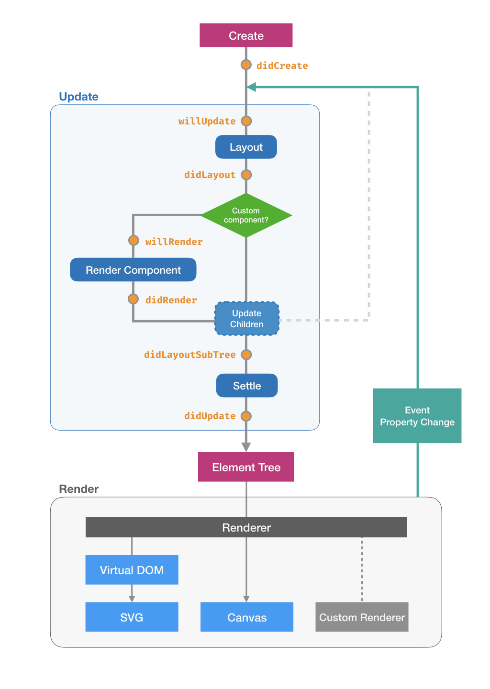

# Lifetime and Hooks

## The Lifetime

The following figure shows the lifetime of a component.

After being created, a component mainly experiences two stages:

1. The **update stage** layouts the component and generates an **element tree**, which is a virtual representation of the entire visualization.
   It contains all the necessary information to draw the actual graph, such as each element's finalized position, size, fill and stroke color, and event listeners.
2. The **rendering stage** uses the element tree to render the graph.
   Oviz natively provides SVG and canvas renderer, but additional renders can be added to do extra work.

In other words, layout and rendering are two isolated processes.
This design ensures that the update stage is done entirely offline and doesn't involve any drawing stuff, so it's renderer-independent, without needing to care about specific SVG or Canvas quirks.
The element tree, which contains pure geometry and graphical data of the visualization, can then be handled in different ways.



The updating stage is our focus when implementing a custom component.

- It firstly **layouts** itself. In this procedure, it calculates its size and position from its props, including the relative ones.
- Then if it's a custom component, i.e., it has a **render function**, the render function is called, and its children are updated.
- Now that all children are available, it updates its children recursively. Each child will go then through the update stage.
- After updating all its children, the component's size can be finally **settled** (because sometimes a component's size can be affected by its children, such as `Container`). It also updates its position based on its anchor in this step.

## Hooks

### Register hooks

It is possible to run some extra logics when the custom component is created or laid out.
For example, `Container` has a `didLayoutSubTree` hook to update its own size based on its children's sizes.

To register hooks, simply add member methods in the class:

```js
class MyComponent extends Oviz.Component {
    didCreate() {
        console.log("Created!");
    }
}
```

### Commonly-used hooks

#### Create

**didCreate**

Called when the component is created. It's called only once for each component.

#### Update

**didLayout**

Called each time when the layout is finished.

All geometry values, including `this.$geometry`, are available now; however, it's better to add size calculation in `willRender`.

**willRender**

Called each time when the component's render function is called.

It is recommended to add any data prepration and preprocessing in this hook.
You can use `this._firstRender` to determine whether it's a re-render.

```js
willRender() {
    if (this._firstRender) {
        // initialize some flags
    }
    // other data preprocessing
}
```

**didLayoutSubTree**

Called each time when the layout of all its children has been finished.
It is possible to get children's sizes and the component's final size here.

**didUpdate**

Called each time when the update is finished.

#### Render

**didMount**

(SVG only) Called when the corresponding SVG element is created.

**didPatch**

(SVG only) Called each time when the corresponding SVG element has been updated.
Two arguments `(oldNode: VNode, newNode: VNode)` are available for this hook.

#### Destroy

**willDestroy**

**didUnmount**

(SVG only) called when the component is unmounted.