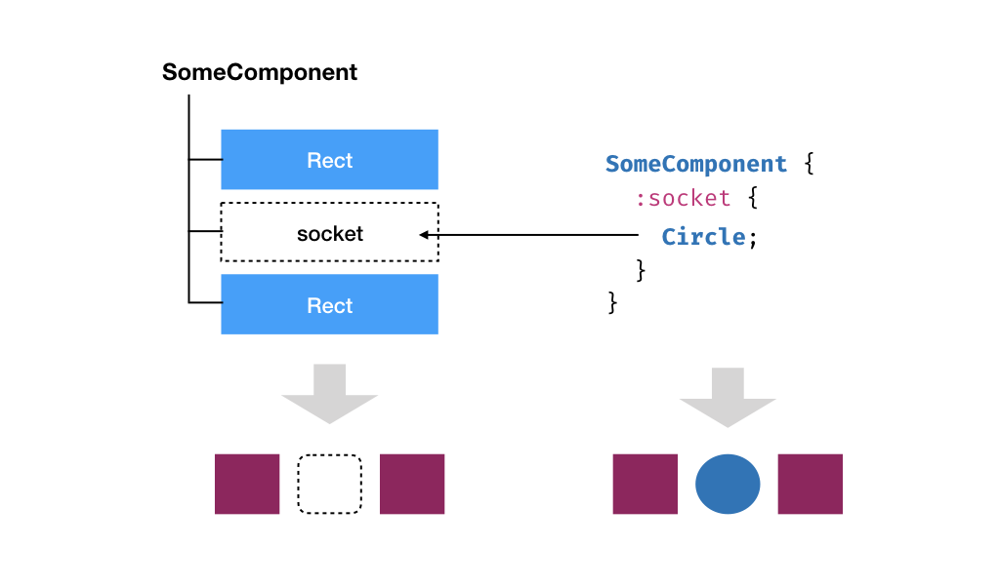
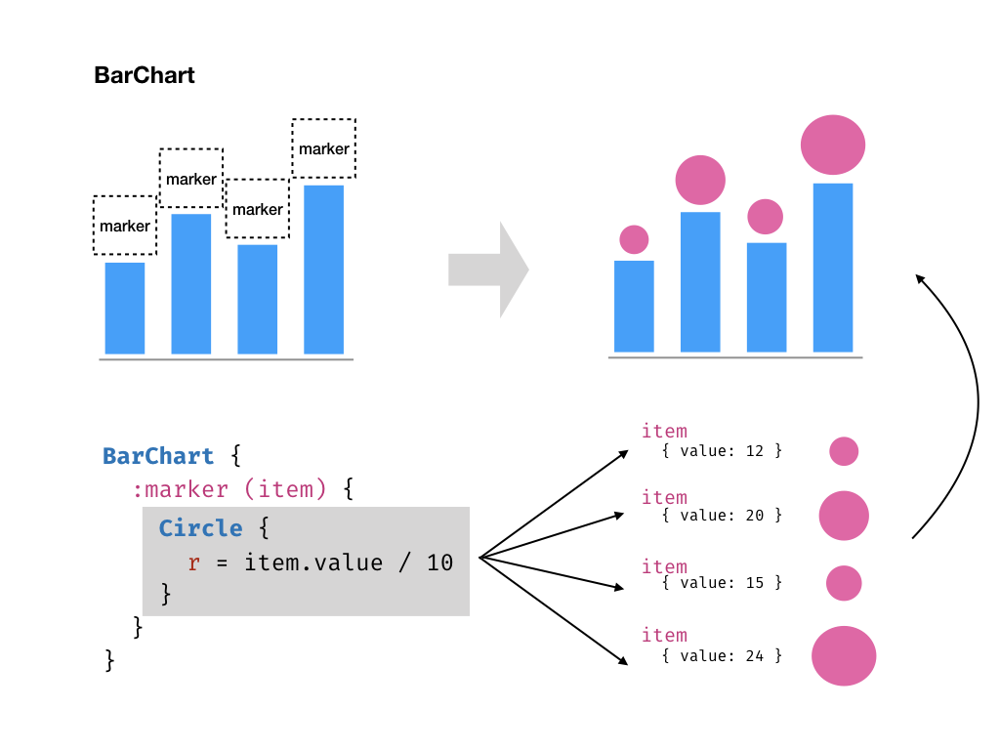

# Customizing Components

One of the most potent features Oviz provides is the ability to encapsulate new components.
It also has some important mechanisms to make a component flexible and extensible.

## Delegated Props

Oviz provides a built-in component `Arrow` that renders an arrow.

<div class="demo" data-height="100">
Arrow {
    x = 0; y = 50; x2 = 190; y2 = 50
}
</div>

An arrow consists of a `Line` as the shaft and a `Triangle` as the head.
Here comes the question: how to control the appearance of them, such as the fill color of the arrow head, or the stroke width of the shaft?

One solution would be _defining_ more props on `Arrow`, such as `headFill`, `headStroke`, `shaftStrokeWidth`, and so on.
A significant disadvantage is that such props can hardly be exhaustive.
We must add numerous props to provide sufficient elasticity and meet the need for fully controlling the components inside.
If we are going to add new components inside `Arrow`, we may also need to define those props for them,
which result in inflexibility of `Arrow` and repeated work.

To solve this problem, we have **delegated props**.
It is a mechanism which let custom components to _expose certain inner components with names_, so that users can thus supply any prop for them.

Delegated props look like:

```bvt
element.prop = value
```

`Arrow` exposes the `Line` with name "shaft" and `Triangle` named "head".
Rather than having dedicated props on `Arrow`, we now supply props _directly_ to the `Triangle` and `Line` inside.
And the template for rendering a customized `Arrow` may look like:

<div class="demo" data-height="150">
Arrow {
    x = 0; y = 50; x2 = 190; y2 = 50
    shaft.strokeWidth = 6
    shaft.stroke = @color(1)
    shaft.dashArray = "4,4"
    head.width = 18
    head.height = 18
    head.fill = @color(0)
}
</div>

See the documentation of each component for their supported delegated props.
We will also cover later on how to add support for delegated props when writing a new component.

## Sockets

Custom components have their predefined children, but it brings stiffness if their types and numbers are immutable.
For example, a user would like to add some custom markers to each bar of the bar chart - which is almost impossible in most chart libraries.
Although some of them may provide some preliminary support, they aren't flexible enough to allow detailed customization for the marker: what if the user wants to add interactions (like tooltips) for them?

As a front-end framework partly inspired by Vue and React, Oviz has a mechanism called **socket** to support the customization of a component's children.

A custom component may have multiple sockets defined in its template, indicating that the user can _insert_ anything here. Each socket has a _name_ and some optional _data_ attached.



A socket blocks start with `:`, following by the name of the socket. You are free to supply anything as the content of the socket block, and the content will be inserted at the corresponding place.
It's possible to write more than one component in a socket block.

```bvt
SomeComponent {
    :socket (data) {
        // component to insert
    }
}
```

### Attached data

The content you provided may serve as a template and be _rendered multiple times_.
Recall the bar chart marker example, since the number of bars changes according to input data, we don't know the count of markers, and it's also impracticable to provide sockets separately for each marker.
Instead, we only have one socket and use the attached data to distinguish each marker.

You can think the `data` in the parentheses as the argument of the socket block; therefore you can change its name freely.

If we have a `BarChart` component that supports custom markers via a socket named `marker`, and we know that the socket has attached data in the following format:

```js
{
    name: string, // the category name
    value: number, // the corresponding value of the bar
}
```

Here is a possible usage if we want to draw a custom marker that comprises a label and a circle whose radius is proportional to the value:

```bvt
BarChart {
    :marker (item) {
        Circle {
            r = item.value / 10
        }
        Text {
            text = item.name
        }
    }
}
```



If you don't need the attached data, you can omit it safely:

```bvt
SomeComponent {
    :socket {
        // component to insert
    }
}
```

### The default children socket

If you add children directly to a custom component without providing the socket block, you are using the default `children` socket.
That said,

```bvt
SomeComponent {
    Circle;
}
```

is equivalent to

```bvt
SomeComponent {
    :children {
        Circle;
    }
}
```

Therefore, if a component doesn't support a `children` socket, adding child blocks directly to it has no effect.

